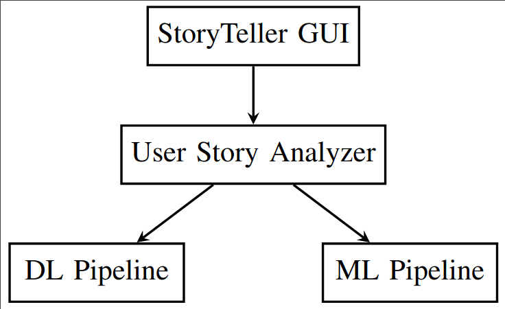

# StoryTeller: Analyzing User Stories for Supporting Software Evolution in Industry


**Authors:** [Nicolas Ganz](https://www.zhaw.ch/en/about-us/person/gann/), [Christian Aeberhard](https://github.com/niddhog), [Marc Kramer](https://github.com/Makram95), [Janik Lüchinger](https://github.com/jluech), [Tanzil K Mohammed](https://github.com/tanzilkm), [Andrea Di Sorbo](https://www.unisannio.it/en/user/9355/curriculum), [Sebastiano Panichella](https://spanichella.github.io/)

### License

_StoryTeller_ is licensed under the GNU Affero General Public License. Every file should include a license header, if not, the following applies:

```
_StoryTeller_ is a a tool designed to analyze user stories.
Copyright (C) 2023 Nicolas Ganz and Sebastiano Panichella.

This program is free software: you can redistribute it and/or modify
it under the terms of the GNU Affero General Public License as published by
the Free Software Foundation, either version 3 of the License, or
(at your option) any later version.

This program is distributed in the hope that it will be useful,
but WITHOUT ANY WARRANTY; without even the implied warranty of
MERCHANTABILITY or FITNESS FOR A PARTICULAR PURPOSE.  See the
GNU Affero General Public License for more details.

You should have received a copy of the GNU Affero General Public License
along with this program.  If not, see <https://www.gnu.org/licenses/>.
```

Carefully read the [full license agreement](LICENSE.md) or the [online version](https://www.gnu.org/licenses/agpl-3.0.en.html).

> "... [The AGPL-3.0 license] requires the operator of a network server to provide the source code of the modified version running there to the users of that server."

## Overview
1. [Summary of the Work](#section1)
2. [_StoryTeller_ Tool](#section2)
3. [Our Contributions](#section3)
4. [Evaluation Context](#section4)
5. [Datasets](#section5)

## 1. Summary of the Work<a name="section1"></a>
User stories play an essential role in software development, but they often vary in quality and structure, making their analysis laborious.
Although there have been studies proposing tools automating the inspection of user stories, there is a lack of research on the usability, scalability, and accuracy of such tools in real-world scenarios.

This paper investigates the quality attributes of a tool called StoryTeller, designed to analyze user stories in industrial settings.
Specifically, with a UX designer, a software engineer, and a project manager from a company with over 20 years of experience in market analysis, we conducted an industrial evaluation of StoryTeller, revealing its low scalability and usability, despite the high accuracy achieved in classifying user stories.
We share insights on how we adapted and evaluated StoryTeller in the industrial environment, including refactoring the code and designing a user-friendly interface.

## 2. _StoryTeller_ Tool <a name="section2"></a>

**_StoryTeller_** classifies user stories through three steps: (1) text splitting into sentences, (2) vector representation of sentences, and (3) automated classification using Machine learning (ML) or Deep learning (DL) strategies.
*_StoryTeller_* acts as a wrapper and combines both a ML and DL component inside a single executable instance.
The set of labeled data sets used to apply to both the ML and DL Pipelines and to evaluate their resulting precision and accuracy values are provided in this repository.

**Overview of _StoryTeller_ Architecture:**

[](https://github.com/spanichella/ARIES-story-teller/blob/main/StoryTeller-Architcture.png)

**How to install _StoryTeller_:** see [combined-pipelines/README.md](./combined-pipelines/README.md)


## 3. Our Contributions<a name="section3"></a>
 Research tools have been proposed to analyze user stories to support software evolution activities. However, very few studies investigated the usability, scalability, and accuracy of a tool enabling the analysis of **_user stories in industrial settings_**. To fill this gap, we investigate the usability, scalability, and accuracy of StoryTeller, a tool we designed to analyze user stories, through an industrial evaluation involving developers and requirement engineers of a company called SM-company, a leader in employee survey evaluations in Switzerland.

### 4 Evaluation Context<a name="section4"></a>

**SM-Company**. For confidentiality, the company selected for evaluation is referred to as the Swiss-Marketing Company (SM-Company) and its project as the SM Software Project (SM-Project). The SM-Project is a web-based survey tool launched by the SM-Company to support team and project managers in creating short, easy-to-use pulse surveys. The SM-company was founded in 2002. It has over 20 years of expertise in market and company analysis. Based on well-founded study concepts, user-friendly surveys, and meaningful reporting, the company offers a wide variety of products in the field of employee satisfaction, customer satisfaction, and
leadership feedback.

### 5 Datasets <a name="section5"></a>
Related studies pointed out that the lack of data from requirement elicitation sessions is an obstacle in this type of classification approach.
Thus, we provided [datasets](datasets) for validating the accuracy and usability of the _StoryTeller_ tool.

1) To assess the classification accuracy achieved by the ML pipeline of StoryTeller, we conducted an empirical evaluation involving a dataset of user stories provided by the *SM-company*. three participants of the *SM-company* such as a UX designer, a software engineer, and the project manager,  shared with us a dataset concerning an internal RE meeting concerning the *SM-Project*, containing the corresponding anonymized textual transcripts, derived from the transcribed audio recording of the RE meeting by the participants. Thus, we asked the participants to manually (and collaboratively) label the data in a format compatible with StoryTeller. As result, we obtained a [dataset](datasets)  (available in our repository) having in total 664 statements that have been manually labeled as *functional* (150) or *non-functional* (45) requirements, or as irrelevant (the remaining 469) statements by the participants.
2) To further investigate whether StoryTeller can mitigate the results of previous work, we created a dataset that combines the datasets from previous studies and the one from the SM-company. Hence, we experimented with the ML pipeline of StoryTeller on such a dataset.

### ACKNOWLEDGMENTS & Credit Author Statement
We gratefully acknowledge the Innosuisse support for the project *ARIES* (Exploiting User Journeys for Supporting Mobility as a Service Platforms),
Project No.45548.1. **Web page**: https://www.aries-devops.ch/index.html. We thank [Marcela Ruiz](https://www.zhaw.ch/en/about-us/person/ruiz/) for the review on the original version of the paper.

As follow, the Credit Author Statement for each of the authors.
- Nicolas Ganz: Data curation, Software, Writing - review & editing.
- Christian Aeberhard, Marc Kramer, Janik Lüchinger, Tanzil Mohammed: Software,  Validation.
- Andrea Di Sorbo: Methodology, editing, Repository review, Project administration.
- Sebastiano Panichella: Data curation, Conceptualization, Software, Methodology, Investigation, Validation, Writing - original draft & editing, Project administration.
