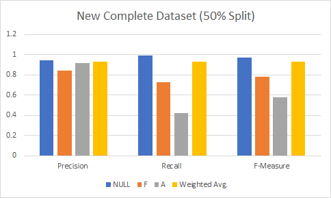
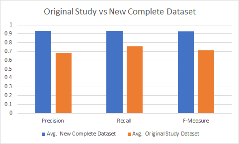

# Datasets

## Complete 
This dataset is a collection of all the datasets merged into one single dataset.
Specifically, it includes the following datasets: Recording, Stories, Study.

## Combined
This dataset makes up our contribution of collected data to the project.
Specifically, it combines the following two datasets: Recording, Stories.

## Recording
This dataset has been crafted from a custom requirement elicitation session transcript.
We recorded such a session, transcribed it to text using dedicated tools, and manually formatted and labeled the data.

## Stories
This dataset is made up of user stories (taken from an openly accessible, already established dataset [1]) for valid requirements and rubbish data to fill for classification (randomly chosen `NULL` lines from existing dataset [2]).

## Study 
This dataset represents the data used in the previous work [2] and has not been adjusted in any way.

# Generation Script
In this folder you can also find a Python script we used to generate some necessary files that are being used internally during the analysis.
To be more precise, we first convert the given truth set (a `.txt` file) of each dataset into a `.csv` file.
We then extract a training and test set (`.csv` files) out of the truth set by randomly selecting lines according to the partitioning 80:20 and 50:50 (training:test).

Using the ML pipeline of the previous work, we generated the term-by-document matrix files ("tdm", `.csv` files) of each corresponding truth set and copied them into their dedicated folders.
These tdm files are then used to create tdm pendants of the training and test sets by picking the relevant lines contained in the `.csv` files out of the truth set tdm file and writing them to a new file (two files per partitioning per dataset, `.csv` files).
The resulting tdm files can ultimately be used as input to the WEKA classifier.

# Study Results and Discussion
- **Precision** is a metric which quantifies the number of correct positive predictions made and is calculated as the ratio of correctly predicted positive examples (out of the total retrieved) divided by the total number of retrieved examples.
- **Recall** is a metric which quantifies the number of correct positive predictions made out of all positive predictions there are. Recall provides an indication of missed positive predictions (contrary to precision).
- **F-measure** is a measure of a test's accuracy and is defined as the weighted harmonic mean of the precision and recall of the test. 

##  Discussion of Precision and Recall From ML Pipeline 
**Original Study Dataset Precision and Recall Result:**\
\

\
In the above graph we see the result from ML model from [Original Study](#studyDS)  with 50% split of dataset as test and training dataset where `NULL` labelled dataset performed  Precision with 80%, Recall 93%,  F-measure with  98%  and  `F` labelled dataset performed  Precision with  45%  Recall with  32% and  F-measure with  38% and  `A` labelled dataset performed poorly in original study 0% Precision, Recall and F-measure. `A` labelled lines in dataset affected the performance of Weighted Avg. of the performance in the original study.
\
**New Complete Study Dataset Precision and Recall Result  :**\
\

\
In the above graph we see the result from ML model from [Complete Study](#CompleteDS)  with 50% split of the dataset as test and training dataset where `NULL` labelled dataset performed  Precision with 91%, Recall 98%,  F-measure with  94%  and  `F` labelled dataset performed  Precision with  71%  Recall with  48% and  F-measure with  58% and  `A` labelled dataset performed better compare to [Original Study](#studyDS)    Precision with 39%, Recall with 21% and F-measure with 27%. 
\

**Compare Original Study Dataset Vs New Complete Study Dataset (Precision and Recall ) :**\
\

\
In the above graph, we compare the performance of [Original Study](#studyDS) and [Complete Study](#CompleteDS) where we can see the Complete Study shows slightly better performance compare to Original Study Dataset in ML pipeline and `A` labelled lines in the dataset has shown some accuracy in the complete dataset where it was 0% in the [Original Study](#studyDS). (Original Study avg. performance  Precision with 68%, Recall with 75% and F-measure with 71% and Complete Study Precision with 86%, Recall with 88% and F-measure with 87%) 
\

# Sources
- [1] F. Dalpiaz, “Requirements data sets (user stories)”, Mendeley Data, V1, 2018, doi: 10.17632/7zbk8zsd8y.1
- [2] S. Panichella and M. Ruiz, "Requirements-Collector: Automating Requirements Specification from Elicitation Sessions and User Feedback," 2020 IEEE 28th International Requirements Engineering Conference (RE), Zurich, Switzerland, 2020, pp. 404-407, doi: 10.1109/RE48521.2020.00057
